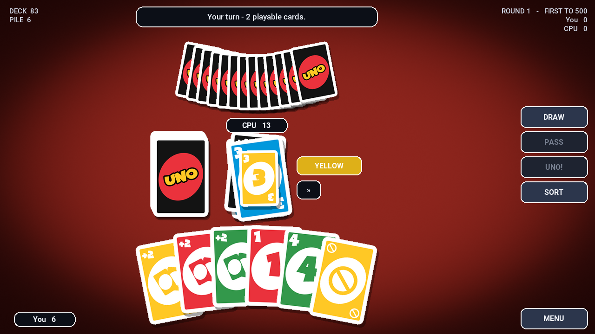

# UNO

A polished single-player UNO-style card game built in Godot 3.x. Play 1v1 or
against up to three opponents, with configurable house rules, three AI
difficulties, match scoring, and a full accessibility pass.



## Highlights

**Game**

- The full 108-card deck, all action cards, and correct two-player Reverse.
- 2–4 players, match scoring to a configurable target, round summaries.
- Three AI difficulties. Hard tracks which colours you are void in and holds
  Wild Draw Four for the moment it hurts most.
- House rules: stacking Draw Twos, draw-until-playable, Seven-Zero, force-play.
- UNO calls, missed-UNO penalties, and catching opponents who forget.

**Feel**

- Cards fan, arc, tilt into a drag, and snap back when you drop them somewhere
  illegal. Everything runs on `SceneTreeTween`.
- Pooled particles, floating score text, screen shake, and colour flashes.
- A complete sound bed — shuffles, deals, plays, penalties, UNO stings, and a
  music loop — **synthesised at runtime**, so no audio files ship in the repo.

**Accessibility**

- Animation speed from 0.5× to 2.0×, applied uniformly to animation, AI thinking
  time, and menu delays.
- Colour-blind markers, high contrast, and independent toggles for screen shake
  and particles.
- Full keyboard and gamepad navigation everywhere.

**Engineering**

- The rules engine has no dependency on the scene tree, so it is tested headless
  in about a second.
- 3070 assertions across three suites, running in CI.
- All on-screen geometry is computed in one place and verified at seven
  resolutions.

## Running it

```bash
# Godot 3.5 or newer in the 3.x line
godot --path . 
```

Or open the folder in the Godot 3.x editor and press play. The main scene is
`Scenes/Gameplay.tscn`.

> Godot 4 will not open this project: it uses the Godot 3 scene format
> (`format=2`) and `config_version=4`.

## Tests

```bash
godot --no-window -s Tests/TestRules.gd         # 370 assertions, ~1s
godot --no-window -s Tests/TestLayout.gd        # 2644 assertions, ~1s
godot --no-window -s Tests/TestIntegration.gd   # 56 assertions, ~30s
```

`TestIntegration` boots the real game scene and drives it through menus,
settings, save/reload, complete matches, window resizes, and teardown. All three
exit non-zero on failure and run on every push.

Linting:

```bash
pip install "gdtoolkit==3.5.*"
gdlint Scripts/ Tests/
```

## Controls

| Action | Mouse / touch | Keyboard | Gamepad |
| --- | --- | --- | --- |
| Play a card | Click, or drag to the pile | `←` `→`, then `Enter` | Stick / D-pad, `A` |
| Draw | Click the draw pile | `D` | `X` |
| Pass | **PASS** | `P` | `Y` |
| Call UNO | **UNO!** | `U` | `RB` |
| Catch a missed UNO | **CATCH!** | `C` | — |
| Sort hand | **SORT** | `S` | `LB` |
| Pause | **MENU** | `Esc` | `B` / `Start` |

Full rules, every setting, and the difficulty breakdown are in
[docs/GAMEPLAY.md](docs/GAMEPLAY.md).

## Layout

```text
Assets/
  Uno Game Assets/     Card and table art (388x562 cards, 5 felt variants)
  Roboto/              Regular / Medium / Bold / Black
Scenes/
  Gameplay.tscn        The only scene; everything else is built at runtime
Scripts/
  Core/                Rules engine - no engine dependencies, headless-testable
    CardTypes.gd       Enums, asset keys, scoring, accessibility glyphs
    CardData.gd        One card
    Deck.gd            108-card deck, seeded shuffle, recycling
    GameRules.gd       Turn state machine and the semantic event queue
    AIPlayer.gd        Opponent decisions
  Systems/
    SettingsManager.gd Versioned config in user://settings.cfg
    AudioDirector.gd   Runtime-synthesised SFX and music
    ThemeFactory.gd    Fonts, colour tokens, styleboxes
    EffectsDirector.gd Pooled particles, floating text, shake
  UI/
    TableLayout.gd     All on-screen geometry, as pure functions
    EventPresenter.gd  Turns rules events into animation and sound
    CardView.gd        One card on screen
    HudLayer.gd        Status, counters, scoreboard, seat plates, buttons
    MenuLayer.gd       Main / pause / settings / help / stats / summaries
    ColorPicker.gd     Wild-card colour overlay
  GameController.gd    Orchestrator: scene, input, turn loop
Tests/                 Headless suites plus the layout dump diagnostic
Tools/
  preview_layout.py    Renders a PNG mock-up from a layout dump
docs/                  Architecture, gameplay, production notes
```

## How the pieces fit

`Scripts/Core` never touches the scene tree. `GameRules` mutates state and
appends semantic events (`CARD_PLAYED`, `PENALTY_DRAW`, `ROUND_ENDED`, …) to a
queue; `EventPresenter` drains that queue and turns it into animation, sound and
HUD updates.

Because state is final before any tween begins, the presentation can be sped up,
slowed down or skipped entirely without the simulation ever disagreeing with
what is on screen. It is also why the rules can be soak-tested for 100 games in
about a second with no window open.

[docs/ARCHITECTURE.md](docs/ARCHITECTURE.md) goes into detail.

## Building

`export_presets.cfg` is committed with HTML5, Linux and Windows presets:

```bash
godot --export "HTML5" build/index.html
```

Exports need the Godot editor binary and the matching export templates.

> **The web build in this repository is not current.** The previously committed
> `build/` directory was a stale export of code that no longer exists, so it was
> removed rather than left to mislead. The GitHub Pages deployment will keep
> serving the old version until someone re-exports from an environment with the
> editor installed.

## Documentation

- [Gameplay and rules](docs/GAMEPLAY.md) — how to play, every setting, AI behaviour
- [Architecture](docs/ARCHITECTURE.md) — layering, the event queue, layout system, testing
- [Production notes](docs/PRODUCTION_NOTES.md) — bugs fixed, performance work, known limitations

## Credits

Card and table art in `Assets/Uno Game Assets/`. Roboto is included under
`Assets/Roboto/` with its license. UNO is a trademark of Mattel; this is an
unaffiliated hobby implementation.

## License

[MIT](LICENSE).
